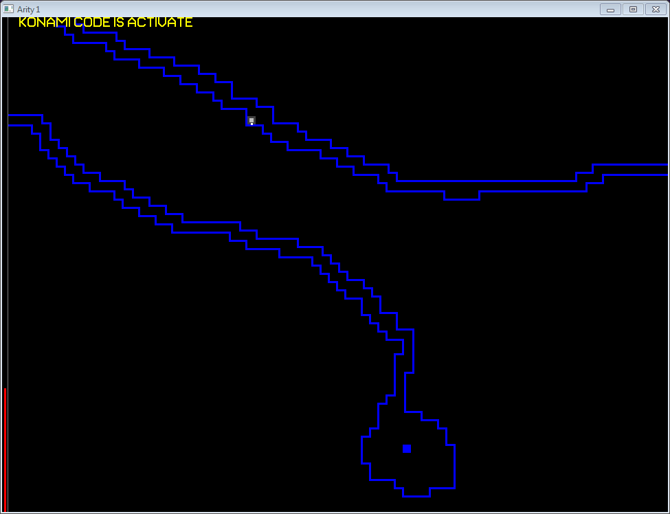

 

This is an unfinished platformer video game inspired by such works as Seiklus, An Untitled Story, and Mole's Quest. It's not a great game, and I've documented a small subset of the issues below.

The game is Arity.exe

# Controls

Press the left and right cursor keys to move
Press the spacebar to jump
Press the down key in front of a save point to save
Press the up key in front of a save point to teleport between saves
Press escape to open the menu

In the teleport map, the red rooms contain save points. The arrow keys move the yellow cursor. When the cursor has an X through it, press space to teleport to the coresponding save point. In order to teleport to a save point, you just first have used it to save.

The player has a double jump, and can triple jump by pressing space again at the very top of the second jump's arc (within a frame or two).

I guess when I started this I wasn't aware of the conflicts between the spacebar and cursor keys.

# Features

## Falling Platforms


In some rooms, platforms descend from the ceiling, and the player is required to use them to reach the top of the room. I struggled to make this fun. Originally, the platforms started at random locations, but even with no other pressures reaching a specific location at the top of a room could be tedious due to bad luck. I attempted to fix the issue by instead having the platform spawn location move back and forth across the width of the room with some random variation, which makes them a little more consistent, but can still be a problem depending on the size of the target and the amount of random variation. 

It never occurred to me that they might work better with designed patterns, but I think that might still present issues. A sufficiently complex pattern will take some time to reset if the player misses, which adds boring dead time to the game. The pattern could be repeated with some phase shift to reduce the effective reset time, but as the instances get closer together they would begin to resemble a simple grid. The actual pattern would cease to matter as every case would just be a matter of climbing a simple ladder. The motion of the platforms would add nothing to the game except some delays.

This mechanic was inspired by a game called Mole's Quest my friend had on his parents' pentium II computer. The player had to traverse a sequence of alternative rising and falling platforms, some of which contained obstacles and some of which contained collectible objects. If you hit the bottom of the top of the screen, you die and have to start over. Mole's Quest used a simple grid of moving platforms on a relatively small screen and didn't really have any geniune platforming elements. You just jump left or right, and depending on the timing you either land on the next platform or hit the edge and die. The concept doesn't seem to translate that well to this kind of platformer.

## Power Ups




There are collectible power ups that permanently increase the player's health, first jump height, or double jump height. At some point I thought that there might be a bit of a metroidvania aspect with some locations requiring a minimum jump height to access. At the same time, the triple jump mechanic provides a (finnicky) means of bypassing jump height requirements. The jump height upgrades ultimately don't add much. Each upgrade is pretty small, so you need a lot to see any significant change in capability. At the same time, the variations in jump height make it difficult to get the hang of the triple jump timing, which is constantly changing as you collect upgrades.

## Turrets


These basically exist to make health matter and to create a failure condition. I struggled to make this fun. They shoot bullets directly at the player with different speeds and sizes. Unfortunately when the player is a pixel and the bullets are fast pixels, its' hard to make any predictions about collision. In most cases you only get hit if you stop moving or get unlucky. I played around with different configurations some, but never found anything that was fun.

Believe it or not this mechanic was inspired by An Untitled Story. One of the bosses can fire a lot of projectiles at the player. When I first played AUS I was still coming to terms with difficulty in games, and the gravity hell bits frustrated me enough to stick with me.

## Bosses


I think the bosses are the closest I got to making the falling platforms relevant. You have to touch a point on the ground, then within a limited time touch a weak spot on the boss in order to damage. Destroy all the weak points to defeat the boss.

## Devmode

With the menu open, enter 

up up down down left right left right z x

When entered correctly, a sound will play and the text "KONAMI CODE IS ACTIVATE" will appear at the top of the screen. This gives unlimited jumps and exposes the entire map. You'll also be able to press up to teleport from anywhere and to any save point.

## Level Editor


There is one (puredit.exe). I remember it being kind of unstable and don't really remember anything about it.

# Misc

## Code blocks

Shortly before I started this game there was a little coding challenge on an indie game dev forum I was active on. The goal was to fit the source code of a game inside 80 by 24 characters. I submitted two entries that informed this game. The executables have been lost to time, but the code hasn't.

One was a bullet hell platformer where you had to use unlimited double jumps to reach the top of the screen without getting hit by projectiles
```
#include <cstdlib>  /*    M     *    **    *   *    * *   *   *     *   *    */
#include <iostream> /*   /|\  *  *  *    **  * * * *   * *   ** * *   *  **  */
#include <cmath>    /*  / | \   * *   *  *  **  *   *  *  *  **   *  o. *  * */
#include <SDL.h>    /* /__|__\     *   *  *    *    ***    **   * *   :* **  */
using namespace std;SDL_Surface* s;typedef struct{float h,xp,yp,xv,yv;}b;void d
(int xp,int yp,Uint32 color){*((Uint32 *)s->pixels+yp*s->pitch/4+xp)=color;}int
main(int argc,char *argv[]){b c,a[192];long st,sc,bn,e,x,y;e=0;bn=0;c.h=10;c.xp
=160;c.yp=238;SDL_Init(32);s=SDL_SetVideoMode(320,240,32,0x40000001);SDL_Event 
event;Uint8* keys;st=clock();while(e==0){keys=SDL_GetKeyState(NULL);
SDL_PollEvent(&event);if(keys[SDLK_ESCAPE])e=1;c.xv=0;if(keys[SDLK_LEFT])c.xv=-
1.5;if(keys[SDLK_RIGHT])c.xv=1.5;if(keys[SDLK_SPACE]&&c.yv<10){c.yv=-2;keys[
SDLK_SPACE]=0;};if(bn<191){++bn;a[bn].yp=3;a[bn].xp=rand()%320;a[bn].xv=.6*rand
()/(float)RAND_MAX-.3;a[bn].yv=.3*rand()/(float)RAND_MAX;}for(x=0;x<320;++x)for
(y=0;y<240;++y)d(x,y,0);c.xp+=c.xv;if(c.xp<0||c.xp>319){c.xp-=c.xv;c.xv=0;}c.yv
+=.08;c.yp+=c.yv;if(c.yp>239){c.yp=239;c.yv=0;}if(c.yp<3){c.yp = 3;c.yv=10;st-=
1000;}for(x=0;x<bn;++x){a[x].xp+=a[x].xv;a[x].yp+=a[x].yv;if(a[x].xp<0||a[x].xp
>319){a[x].xv*=-1;a[x].xp+=2*a[x].xv;}if(a[x].yp<3||a[x].yp>239){a[x].yv*=-1;a[
x].yp+=2*a[x].yv;}if(abs(c.xp-a[x].xp)<=1&&abs(c.yp-a[x].yp)<=1)--c.h;a[x].xv*=
1.001;a[x].yv*=1.001;d(a[x].xp,a[x].yp,16711680);}d(c.xp,c.yp,2147483647);for(x
=0;x<c.h*32;++x)d(1+x,1,65280);st-=(239-c.yp)/16;sc=clock()-st;if(c.h<1)e=1;
SDL_Flip(s);SDL_Delay(16);}cout<<"sc = "<<sc<<endl;}
```

The second was a platformer with regular jump mechanics and falling platforms the player had to use to reach the top of the screen... 4 times.
```
#include <cstdlib>  /*    M         ___                                       */ 
#include <iostream> /*   /|\                      ___                         */ 
#include <cmath>    /*  / | \          ___                o.                  */ 
#include <SDL.h>    /* /__|__\                             :     ___          */ 
using namespace std;SDL_Surface* s;typedef struct{float h,xp,yp,xv,yv;}b;void d( 
int xp,int yp,Uint32 color){*((Uint32 *)s->pixels+yp*s->pitch/4+xp)=color;}int  
main(int argc,char *argv[]){b c,a[9];long st,sc,bn,e,x,i,y,g;e=0;bn=0;c.h=4;c.xp 
=160;c.yp=238;SDL_Init(32);s=SDL_SetVideoMode(320,240,32,0x40000001);SDL_Event  
event;Uint8* keys;st=clock();while(e==0){keys=SDL_GetKeyState(NULL); 
SDL_PollEvent(&event);if(keys[SDLK_ESCAPE])e=1;c.xv=0;if(keys[SDLK_LEFT])c.xv=-3 
;if(keys[SDLK_RIGHT])c.xv=3;if(keys[SDLK_SPACE]&&g){c.yv=-5;keys[SDLK_SPACE]=0; 
srand(clock());}g=0;if(bn<8&&clock()>1250*bn){++bn;a[bn].yp=3;a[bn].xp=10+rand() 
%300;}for(x=0;x<320;++x)for(y=0;y<240;++y)d(x,y,0);c.xp+=c.xv;if(c.xp<0||c.xp> 
319){c.xp-=c.xv;c.xv=0;}if(!g)c.yv+=.2;c.yp+=c.yv;if(c.yp>239){c.yp=239;c.yv=0;g 
=1;}if(c.yp<3){c.yp = 3;c.yv=10;--c.h;}for(x=0;x<bn;++x){a[x].yp+=.5;if(a[x].yp> 
239)if(a[x].yp>239){a[x].yp=3;a[x].xp=10+rand()%300;}if(c.yp>a[x].yp&&(c.yp-c.yv 
)<a[x].yp&&abs(c.xp-a[x].xp)<=9){c.yv=.5;c.yp=a[x].yp-1;g=1;}for(i=0;i<18;++i)if 
(a[x].xp-9+i>=0&&a[x].xp-9+i<320)d(a[x].xp-9+i,a[x].yp,16711680);}d(c.xp,c.yp, 
2147483647);for(x=0;x<(4-c.h)*80;++x)d(x,1,65280);sc=clock()-st;if(c.h<1)e=1; 
SDL_Flip(s);SDL_Delay(16);}cout<<"sc = "<<sc<<endl;}
```


